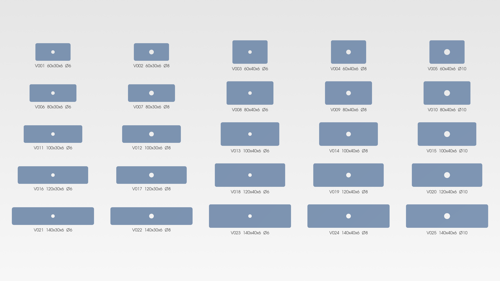

# cadquery-variant-generator

Batch generation of parametric CAD variants from a CSV table.
Define a part once as a Python function, list the dimension sets you need,
and get STEP and STL files for every row.



The example part is a rectangular plate with a centre hole and filleted
corners. The 25 variants above cover five lengths, two widths and three
hole diameters. The full run, including both export formats and the
manifest, completes faster than opening the same part in a GUI CAD system.

## Why

Configuring a part family by hand takes a few minutes per variant and the
result is not reproducible. When the customer changes one dimension, the
work starts over. A script takes the dimension table as input, so a
revision means editing a row and running the generator again.

Most deliveries are the output files themselves: the customer supplies the
dimensions and receives the exported set. The scripts are included for
customers who want to run the generator themselves.

## Requirements

- Python 3.11
- CadQuery 2.8
- openpyxl (for the Excel manifest)
- vtk (for the preview renders)

```
conda create -n cad python=3.11
conda activate cad
conda install -c conda-forge cadquery openpyxl vtk
```

## Files

```
plate.py               the part definition
generate_variants.py   reads the table, exports every row
render_preview.py      grid image of the whole set
render_detail.py       close-up of one variant
view_variants.py       interactive check in the CAD viewer
```

## Usage

Define the dimension table in `variants.csv`:

```
variant_id,length_mm,width_mm,height_mm,hole_dia_mm,fillet_r_mm
V001,60,30,6,6,3
V002,60,30,6,8,3
```

Run the generator:

```
python generate_variants.py
python generate_variants.py variants.csv output --formats step
```

Arguments are optional. The defaults are `variants.csv`, `output`,
and both formats.

## Output

```
output/
├── manifest.csv
├── manifest.xlsx
├── step/          V001.step ...
├── stl/           V001.stl ...
└── preview/       grid.png, detail.png
```

The manifest records the parameters, output paths and status of every row,
so any file can be traced back to the dimensions it came from. It is
written in both CSV and XLSX; the Excel copy opens correctly regardless of
the regional list separator.

## Error handling

Input errors and geometry errors are treated differently.

Input errors, such as a missing value, a non-numeric field or a duplicate
`variant_id`, are found by scanning the whole table before any geometry is
built. If the table contains one, nothing is generated and every problem is
reported at once. This avoids a half-finished output directory with no
record of what happened.

Geometry errors can only appear during the build. A fillet radius that
exceeds the available material, for example, fails inside the kernel. Such
a row is recorded in the manifest with a `failed` status and the remaining
rows are still generated.

Three CSV files are included to exercise both paths: `variants.csv`,
`variants_broken.csv` and `variants_geom.csv`.

## Preview images

```
python render_preview.py
python render_detail.py --variant-id V013
```

Both scripts render offscreen with VTK at 3840x2160 and read the manifest,
so only successfully generated variants appear. They require STL output.

## Limits

- The example part is deliberately simple. The generator is the subject
  here, not the geometry.
- Valid parameter ranges are not checked. A fillet radius larger than half
  the width will fail in the kernel rather than being rejected up front.
- Kernel error messages are passed through unchanged, so a failed row may
  read `BRep_API: command not done` rather than something more specific.
- DXF output is not implemented.
- The preview scripts read STL, so a STEP-only run has no preview.
